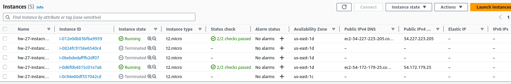
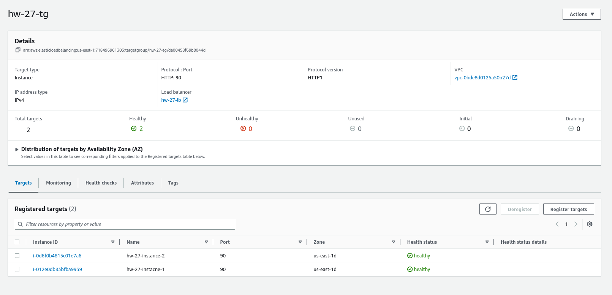
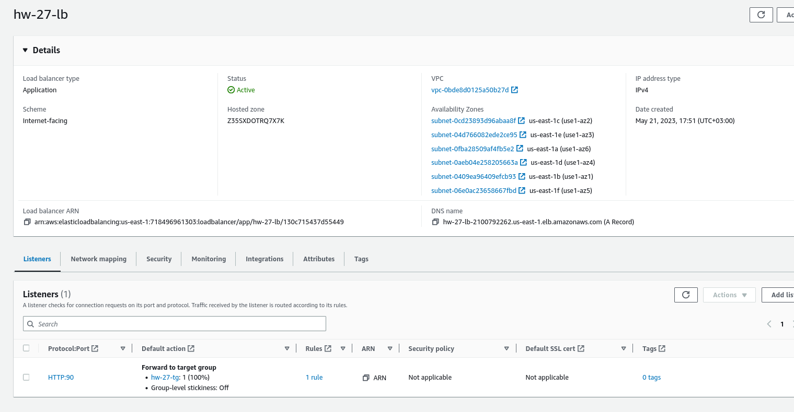

# Load-balancer-aws
Set up load balancer in AWS

* Set up two instances 

* Set up target group with this instances (targets) - healthcheck also was added by endpoint `/helath`

* Set up load balancer with this target group 

